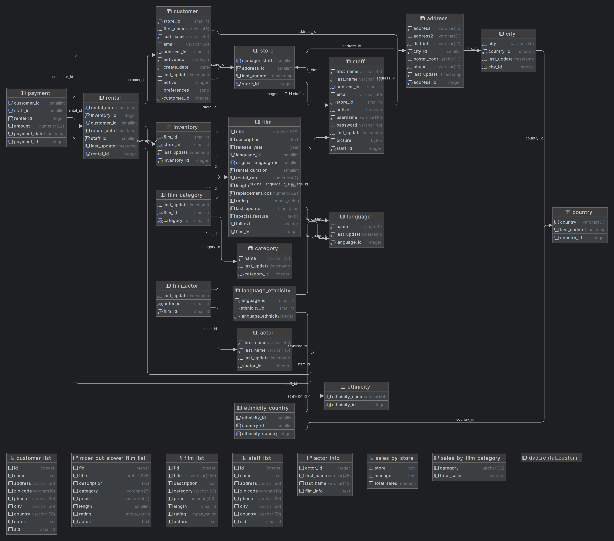

# Учебная база данных `DVD Rental`

Учебная база данных **DVD Rental** моделирует работу видеопроката, который сдаёт DVD‑диски в аренду клиентам через сеть магазинов.  
Она используется как стандартный пример в обучении SQL и PostgreSQL и позволяет отрабатывать типовые бизнес‑процессы: фильмы, актёры, клиенты, аренда, платежи и работа сотрудников.

---

В этом репозитории я использую базу **DVD Rental** для тренировки написания и отладки SQL‑запросов в формате учебных заданий.

## Домашние работы

- [HW1 — Базовые запросы](./HW1/README.md)
- [HW2 — Агрегации и JOIN](./HW2/README.md)
- [HW3 — Проектирование и DDL](./HW3/README.md)
- [HW4 — Оконные функции и подзапросы](./HW4/README.md)
- [HW5 — Массивы, CTE и матпредставления](./HW5/README.md)
---

## Резервная копия базы данных **dvd-rental**

  [`dvd-rental_custom.backup`](https://letsdocode.ru/sql-materials/backups/dvd-rental_custom.backup)

---

## Описание базы данных

- База данных **DVD Rental** является **учебной** и может содержать упрощения по сравнению с продакшн‑системами.
- Модель данных представляет собой фрагмент ИС сети видеопроката, которая:
  - хранит информацию о фильмах, актёрах, категориях и языках;
  - управляет магазинами и сотрудниками;
  - учитывает клиентов и их адреса;
  - регистрирует аренду и возврат DVD‑дисков;
  - хранит историю платежей клиентов за аренду.

Ключевые таблицы:

- `actor` – актёры (имя, фамилия);
- `film` – фильмы (название, год выпуска, длительность, рейтинг и др.);
- `film_actor` – связь многие‑ко‑многим между фильмами и актёрами;
- `category` – категории фильмов (комедия, драма и т.п.);
- `film_category` – связь между фильмами и категориями;
- `language` – языки, на которых доступны фильмы;
- `inventory` – конкретные экземпляры DVD‑дисков в магазинах;
- `store` – магазины видеопроката;
- `staff` – сотрудники магазинов;
- `customer` – клиенты видеопроката;
- `rental` – факты аренды: кто, какой диск и когда взял / вернул;
- `payment` – платежи клиентов за аренду;
- `address`, `city`, `country` – адресная информация для клиентов, сотрудников и магазинов.

Помимо таблиц, база включает дополнительные объекты: представления, последовательности, функции и триггер, что делает её ближе к реальному приложению.

---

## Для чего используется

На базе **DVD Rental** удобно отрабатывать:

- простые и сложные выборки с несколькими `JOIN`;
- группировки и агрегаты (выручка, количество аренд, активность клиентов);
- подзапросы и CTE;
- оконные функции и аналитику по временным рядам;
- работу с датами (анализ аренд по дням/месяцам);
- бизнес‑аналитику: топ‑фильмы, активные клиенты, продажи по категориям и магазинам.

---

## Диаграмма данных

