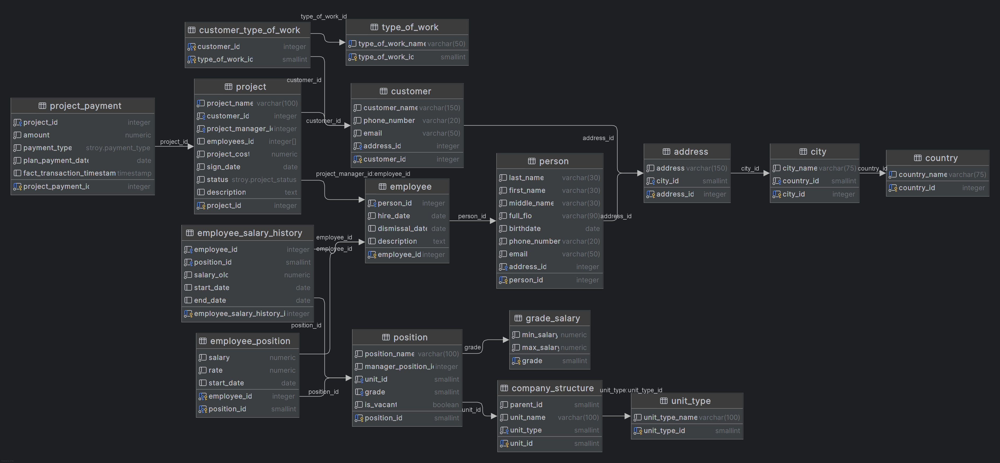

# Учебная база данных `stroy`

База данных **stroy** используется в итоговом проекте как учебный пример производственной компании, которая занимается строительством и проектированием.  
Она не содержит реальных персональных или коммерческих данных и предназначена исключительно для отработки SQL‑запросов и проектирования аналитических отчётов.

---

## Итоговая работа

- Папка с итоговым домашним заданием: [`Final_hw`](./Final_hw/)

---

## Резервные копии базы данных

Вы можете развернуть базу у себя локально в PostgreSQL двумя способами:

- Резервная копия в формате `*.backup` (для `pg_restore`):  
  [`stroy.backup`](https://letsdocode.ru/sql-main/stroy.backup)

- Резервная копия в формате `*.sql` (plain SQL‑дамп, для `psql`):  
  [`stroy.sql`](https://letsdocode.ru/sql-main/stroy.sql)

---

##  Описание базы данных

- База данных **stroy** является **учебной** и может содержать упрощения, неточности и артефакты в данных.
- Названия сущностей (проектов, контрагентов, типов работ и т.п.) сгенерированы с помощью ChatGPT, остальные значения — случайным образом средствами SQL.
- Модель данных представляет собой фрагмент ИС компании, которая:
  - ведёт проекты по строительству и проектированию;
  - взаимодействует с контрагентами;
  - управляет сотрудниками и их структурными подразделениями;
  - учитывает проекты, платежи, оклады и планируемые авансовые платежи.

Такая схема позволяет отрабатывать:

- работу с датами, периодами и возрастом сотрудников;
- расчёт агрегатов и аналитических показателей по проектам и платежам;
- оконные функции и рекурсивные CTE (иерархия подразделений);
- построение отчётов и материализованных представлений.

---

##  Диаграмма данных

